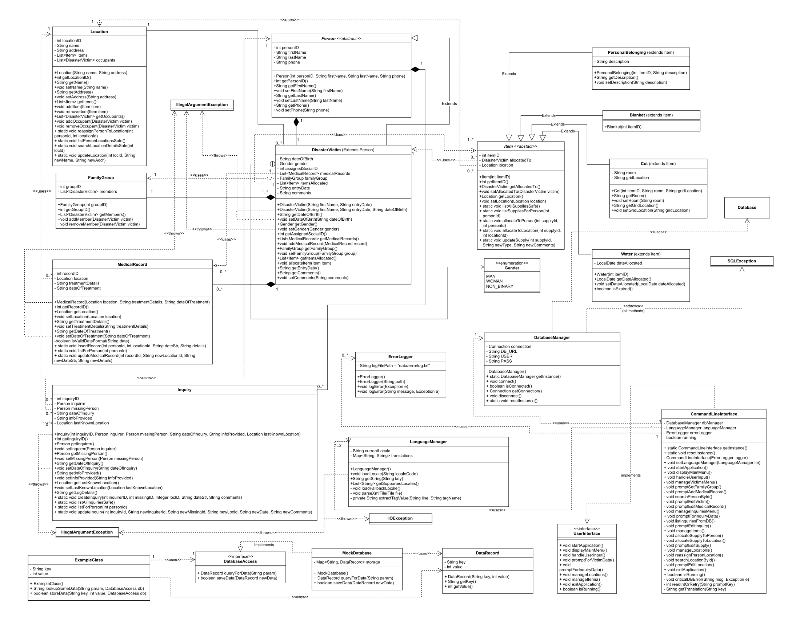

# Disaster-Relief Information System  
*Command-Line Edition with PostgreSQL back-end & multi-language support*  

---

## 1&nbsp;&nbsp;Project Overview  
After large-scale natural disasters relief workers need a **single source of truth** to track displaced people, medical care, supplies, inquiries from relatives, and shelter locations.  
This project delivers a **self-contained command-line application** that:

* registers disaster victims, their relationships & medical history  
* logs inquiries and links them to missing persons and locations  
* manages an inventory of supplies and their allocation  
* maintains dynamic shelter locations and occupant mappings  
* supports **English & Canadian-French** via external XML language packs  
* persists all data in a **PostgreSQL** schema, yet remains fully testable through a **mock database layer**  
* enforces input validation, robust error logging, and automatic expiry of water supplies  

The entire solution is built in **Java 21**, uses only the official **PostgreSQL 42.7.1 JDBC driver**, and is backed by > 90 % unit-test coverage (excluding UI / DB I/O).

---

## 2&nbsp;&nbsp;Key Requirements & How They Were Met  

| Requirement | Implementation Highlights |
|-------------|---------------------------|
| **User-friendly CLI** tolerant to typos | Central `CommandLineInterface` loops & re-prompts; menu text driven by `LanguageManager`; last option in every menu is *Return / Exit*. |
| **Victim management** (create, edit, medical records, family groups) | Domain classes `Person`, `DisasterVictim`, `MedicalRecord`; CRUD via prepared statements; field-level validation. |
| **Inquiry logging & editing** | Static factory / updater in `Inquiry`; menu integration; supports **multiple inquiries per person**. |
| **Inventory tracking** & expiry | Class hierarchy `Item → Blanket/Cot/Water/PersonalBelonging`; `Water.removeExpiredAllocations()` purges stale allocations on startup. |
| **Location administration & editing** | `Location` class handles occupants, inventory; DB updates through `Location.updateLocation` & `reassignPersonToLocation`. |
| **Supply allocation rules** | Allocation updates move a record from location → person, enforcing single owner. |
| **Internationalisation** (dynamic language packs) | `LanguageManager` discovers `aa-BB.xml` files at boot; falls back to *en-CA*. |
| **Graceful error handling** | Centralised `ErrorLogger` writes timestamped `data/errorlog.txt`; fatal DB issues shut down cleanly. |
| **No DB coupling in tests** | Interface `DatabaseAccess` + concrete `MockDatabase` injects fake data for JUnit suites. |
| **Code quality & OOP** | SOLID, layered architecture, design patterns (Singleton, Builder, Strategy, Observer), full Javadoc. |

---

## 3&nbsp;&nbsp;UML Diagram

The UML diagram below illustrates the full object-oriented structure of the application.  
It was used throughout development to organize responsibilities across classes, define relationships such as inheritance (e.g., `Item` → `Water`, `Blanket`), and enforce separation of concerns.  
Associations and multiplicities clarify how victims, locations, inquiries, and inventory relate in the system.  
The diagram helped ensure compliance with **OOP principles** such as **encapsulation**, **inheritance**, and **modularity**, while also guiding test isolation and interface boundaries.



---

## 4&nbsp;&nbsp;Testing Strategy  

* **JUnit 4** + **Hamcrest**; one test-class per production-class – 21 test files.  
* **AAA pattern** in every test; single assert per scenario; descriptive names (`testUpdatePersonInvalidDOB_throws`).  
* **MockDatabase** prevents physical DB usage.  
* Edge-cases: empty strings, nulls, invalid dates, negative IDs, duplicate allocations, expired water.  
* Continuous coverage verified via IntelliJ & JaCoCo (excluding CLI & JDBC I/O).

---

## 5&nbsp;&nbsp;Database Setup & Running

### 5.1 Create the PostgreSQL schema

```bash
psql -U postgres

-- 1) create a dedicated database
CREATE DATABASE ensf380project;

-- 2) create a dedicated user with a strong password
CREATE USER oop WITH ENCRYPTED PASSWORD 'ucalgary';

-- 3) grant ownership / privileges
GRANT ALL PRIVILEGES ON DATABASE ensf380project TO oop;
\q
